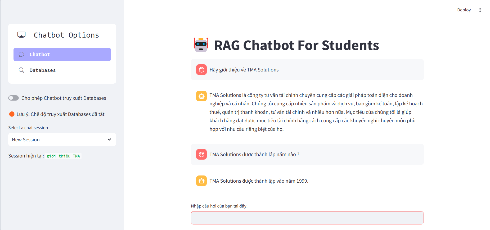
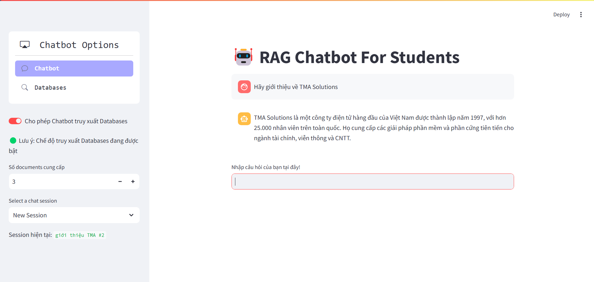
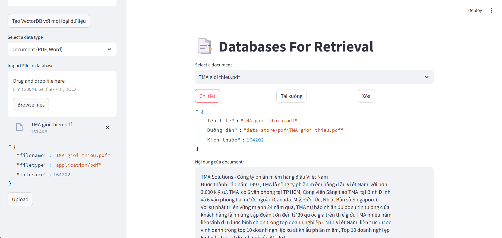
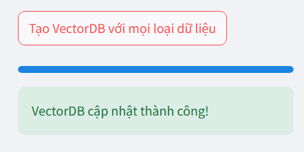
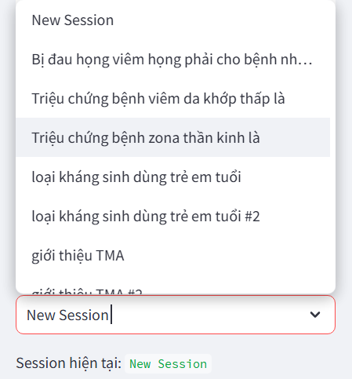
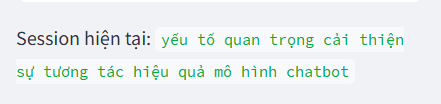

# RAG Chatbot For Vietnamese Students

[](https://llama.meta.com/docs/overview/)
[](https://js.langchain.com/v0.1/docs/modules/chains/popular/vector_db_qa/)
[](https://huggingface.co/sentence-transformers)
[](https://docs.streamlit.io/)
[](https://en.wikipedia.org/wiki/MIT_License)

This project will build an application working like a chatbot for helping students in research document (pdf, word). By using the power of LLMs, students can get the high performance in study and save time for a study lifecycle.

# How to run

- **Step 01:** The source code requires downloading the model file from Hugging Face.

Link: https://huggingface.co/vilm/vinallama-7b-chat-GGUF/blob/main/vinallama-7b-chat_q5_0.gguf

Put your model file in the right file path in ```model_config.yml```
```
chatbot_path:
  Q5bit: "models/Vinallama/vinallama-7b-chat_q5_0.gguf"
```

You can use another model but this project was designed for Vietnamese Chatbot. Please notice!

- **Step 02:** Install Requirements

```cmd
pip install -r requirements.txt
```

- **Step 03:** Streamlit Application Running

```cmd
streamlit run application.py
```

**NOTICE:** The first run will take a long time and requires internet to download the Embedding Model to your device! 

# Overview

**The main features include:**

- **Chatting with a normal LLM Chatbot (LLMChain)**

Prompt Template:
```
<s>[INST] Bạn là một Chatbot AI dành cho sinh viên có nhiệm vụ là giúp đỡ sinh viên trong học tập. [/INST]
Lịch sử hội thoại: {history}
Sinh viên: {human_input}
Chatbot:
```


The limitations of this feature can be clearly seen! That LLM model will try to generate  text without "worrying" about triple H problems (helpful, harmless, honest). So it might generate toxic or untruth response.

FOR EXAMPLE: 

The right information
```
Được thành lập năm 1997, TMA là công ty phần mềm hàng đầu Việt Nam với hơn 3,000 kỹ sư. TMA có 6 văn phòng tại TP.HCM, Công viên Sáng tạo TMA tại Bình Định và 6 văn phòng tại nước ngoài (Canada, Mỹ, Đức, Úc, Nhật Bản và Singapore). Với sự phát triển vững mạnh 24 năm qua, TMA tự hào nhận được sự tin tưởng của khách hàng là những tập đoàn lớn đến từ 30 quốc gia trên thế giới. TMA nhiều năm liền vinh dự được bình chọn trong top doanh nghiệp CNTT Việt Nam, liên tục được vinh danh trong top 10 doanh nghiệp xuất khẩu phần mềm, Top 10 doanh nghiệp Fintech, Top 10 doanh nghiệp AI – IoT…
```

Normal Chatbot Generation



- **Chatting with a RAG LLM Chatbot (RetrievalQA)**

Prompt Template:
```
<s>[INST] Bạn là một Chatbot AI dành cho sinh viên có nhiệm vụ là giúp đỡ sinh viên trong học tập. Hãy dựa vào ngữ cảnh bên dưới để trả lời câu hỏi của sinh viên. [/INST]
Ngữ cảnh: {context}
Lịch sử hội thoại: {history}
Quy tắc: Nếu ngữ cảnh cung cấp không phù hợp với câu hỏi sinh viên thì hãy trả lời rằng trong cơ sở dữ liệu của bạn không có thông tin này và yêu cầu sinh viên tìm kiếm. Vui lòng không trả lời các câu hỏi không liên quan đến sinh viên hoặc liên quan đến các vấn đề nhạy cảm bạo lực và độc hại. Trả lời ngắn gọn.
Sinh viên: {human_input}
Chatbot:
```


This feature will improve and solve the triple H problems from a normal LLM Chatbot. The system will use input from human to make a query to VectorDB and find the similar documents. After that suppying the context to prompt in order to generate text better but the new limitations come. One of these problems is the limit of documents or unsimilar documents. This will make the model generate wrong text or unrelated. We can handle this by adding the rules to prompt.

FOR EXAMPLE:

With the RAG mode, the chatbot is provided the PDF or Word Files about the TMA Technology.

RAG Chatbot Generation



As we can see, the RAG Chatbot generated the good text.

- **Databases Management (Word + PDF, VectorDB)**



This feature help us to upload, delete and see document details. We can initialize VectorDB with all documents.



- **The session system**



The system will save our session every chat to provide history for Chatbot. The response will be better serving human with history conversation.

About the name of sessions, We will use the keyword extraction to name the session. The topic comes from the first question so we will extract keyword from the first question of human.

FOR EXAMPLE:

With question:

```
Các yếu tố nào quan trọng nhất để cải thiện sự tương tác và hiệu quả của mô hình chatbot?
```

Session name:



# References

Meta AI. (n.d.). LLaMA: Open Foundation and Research. Meta AI. Retrieved July 18, 2024, from https://llama.meta.com/docs/overview/

Hugging Face. (n.d.). vilm/vinallama-7b-chat-GGUF. Hugging Face. Retrieved July 20, 2024, from https://huggingface.co/vilm/vinallama-7b-chat-GGUF

LangChain. (n.d.). Vector DB QA. LangChain. Retrieved July 21, 2024, from https://js.langchain.com/v0.1/docs/modules/chains/popular/vector_db_qa/

Streamlit. (n.d.). Streamlit documentation. Streamlit. Retrieved July 21, 2024, from https://docs.streamlit.io/


